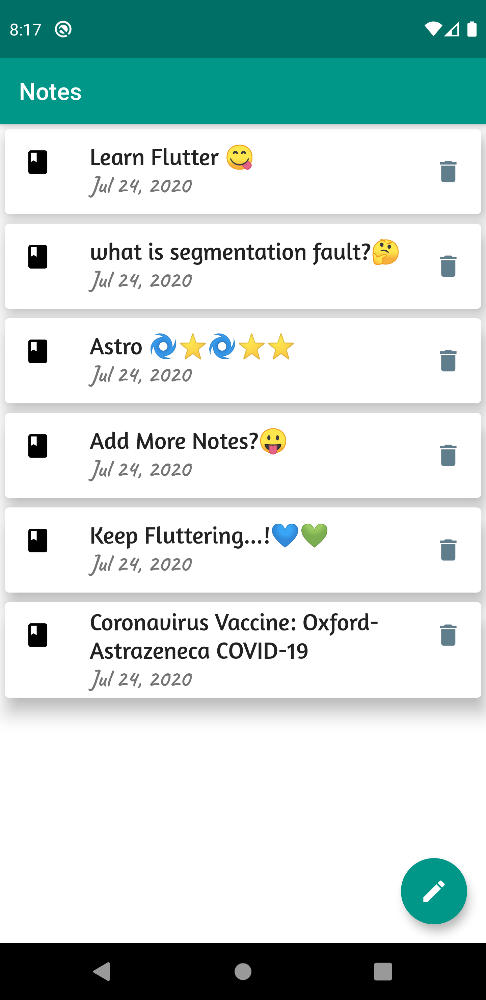

# Note-App

  

A Minimal Note Application in Flutter

## Packages
-  sqflite
-  path_provider
-  intl ^0.16.1

look for these packages at [pub.dev](pub.dev)

## Build And Run

you can [download](https://drive.google.com/file/d/1YEpuxvlIumb7SwoEOuvo2avYikH5o8ms/view?usp=sharing) the release apk for Android 32-bit device directly from [here](https://drive.google.com/file/d/1YEpuxvlIumb7SwoEOuvo2avYikH5o8ms/view?usp=sharing)

## Preview
<table>
<tr>
<td></td>
<td></td>
</tr>
</table>
